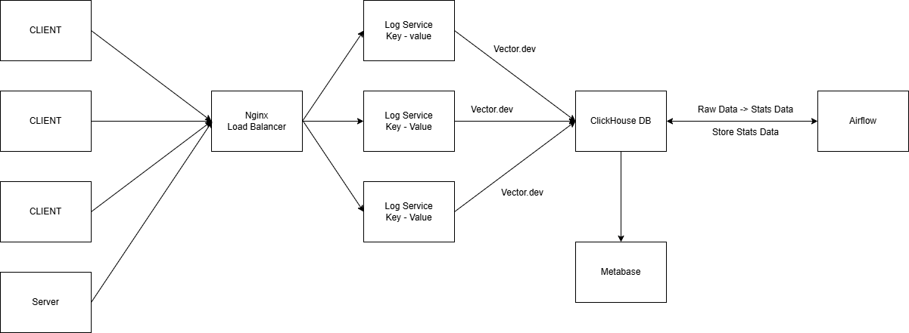
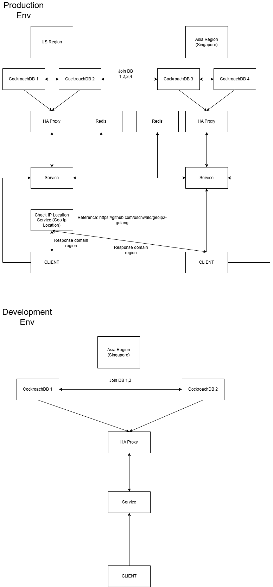
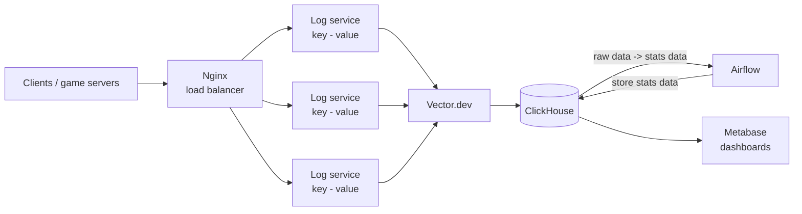
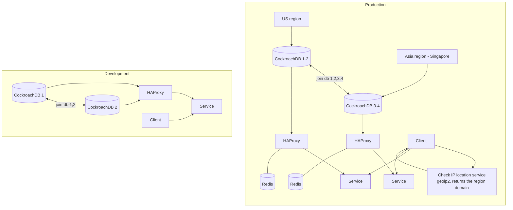

# architecture-diagrams

Architecture diagrams of game backends I have designed and run, kept as **mermaid sources plus
the exported PNGs**, so a diagram can be reviewed in a pull request instead of living in somebody's
laptop.

| Diagram | What it shows | Source |
|---|---|---|
|  | event/log pipeline behind game services | [./diagrams/log-stats-system.mmd](./diagrams/log-stats-system.mmd) |
|  | multi-region game backend with geo routing | [./diagrams/sa-game-global-routing.mmd](./diagrams/sa-game-global-routing.mmd) |

## 1. Log and statistics pipeline

**Problem.** Game servers emit a lot of small events (session, purchase, level, NRU/ARPU inputs) and
the analytics questions are asked hours later, never on the hot path.

**Decisions.** Accept writes behind a load balancer into stateless key-value log services, ship
them with an agent (Vector.dev) rather than from the game process, land them in ClickHouse (a
column store built for exactly this shape), and let Airflow own the raw → aggregate rollups.
Metabase reads the aggregates, so a heavy dashboard cannot slow the ingest path.

**Trade-offs.** Three moving parts (log services, ClickHouse, Airflow) instead of one database, in
exchange for an ingest path that cannot be knocked over by a report and for rollups that can be
re-run after a bug. Log services are stateless, so the fan-out is a load balancer problem, not a
data problem.

## 2. Multi-region game backend with geo routing

**Problem.** Players sit in two regions, and a game backend that runs in one place gives half of
them a bad round trip. But a second region must not mean two players' data diverging.

**Decisions.** One logical database spread over both regions (CockroachDB, joined) so there is no
write-back conflict to reconcile; a service per region behind HAProxy for health checking and
connection multiplexing; Redis per region because a cache that crosses an ocean is worse than no
cache; and a small geo-IP service that hands the client the domain of the region it should talk to
(so the client, not a central router, decides where to reconnect). The development environment is
the same shape with two nodes, which is what makes it possible to test failover without a second
data centre.

**Trade-offs.** CockroachDB costs more per query than a single-node Postgres and forces every query
to be latency-aware; per-region Redis means a cold cache after a failover; and returning a domain
to the client puts a decision in the client's hands - acceptable for a game, where reconnecting to
the nearest region is exactly what you want.

## How this repository stays honest

`npm scripts/check-diagrams.mjs` (run in CI) fails when a diagram source and the README drift
apart: every `diagrams/*.mmd` file must be referenced from the README, and the README must not
contain a diagram without a source file.

## Note on scope

These diagrams describe systems I worked on. They are redrawn here at the level of components and
responsibilities: no internal hostnames, credentials, customer data or vendor-specific
configuration are included, and no code from those systems lives in this repository.

## License

MIT - see [LICENSE](LICENSE).

## About the image files

`diagrams/*.mmd` are the English sources of both diagrams, and they are the versions CI keeps in
sync with the README. The two `*.drawio.png` files are the exports of the original draw.io files,
kept because they are the artefacts as they were drawn at the time; their labels are in Vietnamese.
Read the mermaid sources, not the PNGs.
