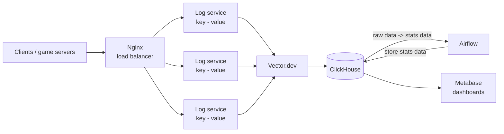
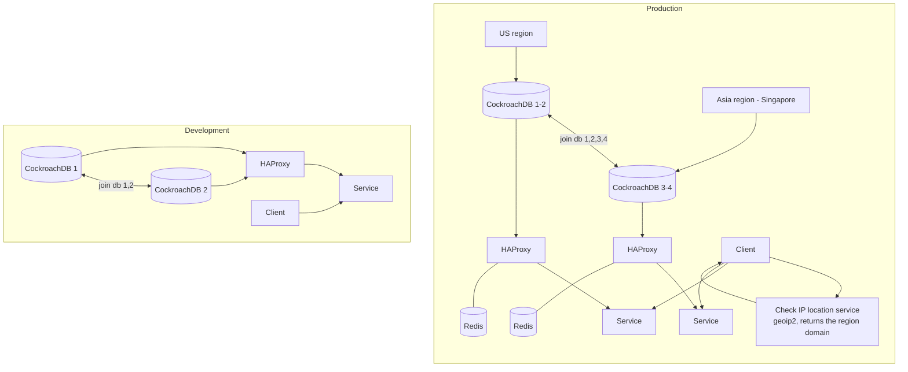
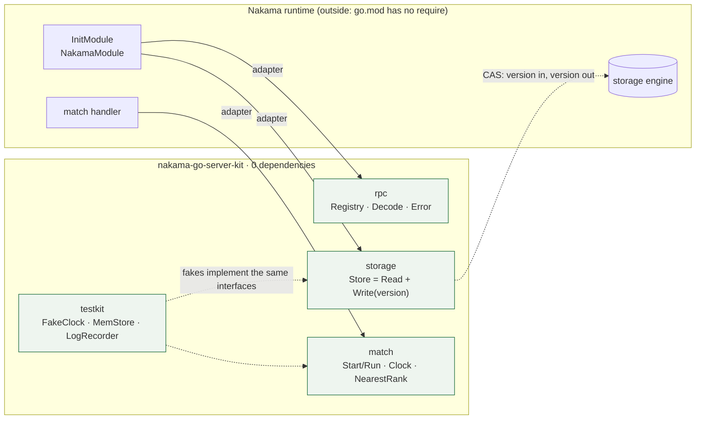
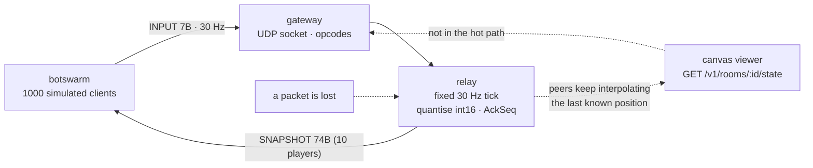

# architecture-diagrams

Architecture diagrams of game backends I have designed and run, kept as **mermaid sources plus
the exported PNGs**, so a diagram can be reviewed in a pull request instead of living in somebody's
laptop.

| Diagram | What it shows | Source |
|---|---|---|
|  | event/log pipeline behind game services | [./diagrams/log-stats-system.mmd](./diagrams/log-stats-system.mmd) |
|  | multi-region game backend with geo routing | [./diagrams/sa-game-global-routing.mmd](./diagrams/sa-game-global-routing.mmd) |

## 1. Log and statistics pipeline

**Problem.** Game servers emit a lot of small events (session, purchase, level, NRU/ARPU inputs) and
the analytics questions are asked hours later, never on the hot path.

**Decisions.** Accept writes behind a load balancer into stateless key-value log services, ship
them with an agent (Vector.dev) rather than from the game process, land them in ClickHouse (a
column store built for exactly this shape), and let Airflow own the raw → aggregate rollups.
Metabase reads the aggregates, so a heavy dashboard cannot slow the ingest path.

**Trade-offs.** Three moving parts (log services, ClickHouse, Airflow) instead of one database, in
exchange for an ingest path that cannot be knocked over by a report and for rollups that can be
re-run after a bug. Log services are stateless, so the fan-out is a load balancer problem, not a
data problem.

## 2. Multi-region game backend with geo routing

**Problem.** Players sit in two regions, and a game backend that runs in one place gives half of
them a bad round trip. But a second region must not mean two players' data diverging.

**Decisions.** One logical database spread over both regions (CockroachDB, joined) so there is no
write-back conflict to reconcile; a service per region behind HAProxy for health checking and
connection multiplexing; Redis per region because a cache that crosses an ocean is worse than no
cache; and a small geo-IP service that hands the client the domain of the region it should talk to
(so the client, not a central router, decides where to reconnect). The development environment is
the same shape with two nodes, which is what makes it possible to test failover without a second
data centre.

**Trade-offs.** CockroachDB costs more per query than a single-node Postgres and forces every query
to be latency-aware; per-region Redis means a cold cache after a failover; and returning a domain
to the client puts a decision in the client's hands - acceptable for a game, where reconnecting to
the nearest region is exactly what you want.

## 3. A game server kit that does not depend on its runtime

**Source.** [`./diagrams/game-server-kit-boundaries.mmd`](./diagrams/game-server-kit-boundaries.mmd)

**Problem.** The part of a game server that decides what happens needs a server runtime to run in, and a runtime changes on its own release cycle. A test that needs a running server is a test that stops being run.

**Decisions.** Four packages that name only interfaces - match, storage, rpc and a testkit - with the adapters living in the server that uses the kit rather than in the kit. The store is a compare-and-swap shape: a read and a write both carry a version, so the same logic runs against the runtime's storage engine and against a fake that keeps a real version.

**Trade-offs.** An interface at each boundary is more code than a direct call, and the wiring moves into the server. What it buys: 55 tests that run in about a second with no server to start, and a body of logic that cannot acquire a dependency on a runtime release. The editorial version, with the measured numbers, is in [nakama-go-server-kit](https://github.com/lasttoss/nakama-go-server-kit/tree/main/docs/diagrams).

## 4. One tick of a 30 Hz UDP room, end to end

**Source.** [`./diagrams/udp-tick-roundtrip.mmd`](./diagrams/udp-tick-roundtrip.mmd)

**Problem.** A realtime room has 33.3 ms per tick and UDP loses packets. The two failures a player notices are a peer that freezes and a client that has already moved past the snapshot it is being sent.

**Decisions.** One fixed-tick simulation per room, positions quantised to centimetres in an int16 so a ten-player snapshot is 74 bytes, rooms bucketed by region so no two matches share a write path, and an AckSeq in every snapshot so a client can replay its inputs and reconcile. A peer that stops being heard from keeps being interpolated from its last known position and is dropped after a timeout.

**Trade-offs.** Interpolation means a peer briefly sees a guess, and quantisation bounds precision to a centimetre. Both are deliberate: the alternative is more bandwidth and resends on a path where the measurement that matters is the tick loop, which spends 19.7 ms of its 33.3 ms budget at the 99th percentile. The editorial version is in [udp-realtime-gameserver](https://github.com/lasttoss/udp-realtime-gameserver/tree/main/docs/diagrams).

## How this repository stays honest

`npm scripts/check-diagrams.mjs` (run in CI) fails when a diagram source and the README drift
apart: every `./diagrams/*.mmd` file must be referenced from the README, and the README must not
contain a diagram without a source file.

## Note on scope

These diagrams describe systems I worked on. They are redrawn here at the level of components and
responsibilities: no internal hostnames, credentials, customer data or vendor-specific
configuration are included, and no code from those systems lives in this repository.

## License

MIT - see [LICENSE](LICENSE).

## About the image files

`./diagrams/*.mmd` are the English sources of both diagrams, and they are the versions CI keeps in
sync with the README. The two `*.drawio.png` files are the exports of the original draw.io files,
kept because they are the artefacts as they were drawn at the time; their labels are in Vietnamese.
Read the mermaid sources, not the PNGs.
